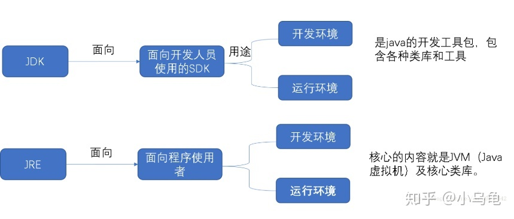

## Java基础知识
### 1. JDK 和 JRE 有什么区别？

### 2. == 和 equals 的区别是什么？
“==”比较的是两个引用在内存中的地址是否相同，也就是说在内存中的地址是否一样。
equals方法是由Object类提供的，可以由子类来进行重写。默认的实现只有当对象和自身进行比较时才会返回true， 这个时候和 “==”是等价的。
Java中很多类（String类 Date类 File类）等都对equals方法进行了重写，这里拿常见的String类举例。
```java
 public class Test {
      public static void main(String[] args) {
          String str1 = "abc";
          String str2 = "abc";
          System.out.println(str1==str2);//true
          String str3 = new String("abc");
          String str4 = new String ("abc");
          System.out.println(str3==str4);//false
          System.out.println(str3.equals(str4));//true
     }
 }
```
先看第三行代码，先在栈中创建一个对 String类的对象引用变量str1，然后通过引用去字符串常量池 里找有没有"abc",如果没有，
则将"abc"存放进字符串常量池。这里常量池中并没有“abc”。即在编译期已经创建好(直接用双引号定义的)“abc”,存储在了常量池中。

第4行代码又创建了对String类的对象引用str2，然后通过引用去字符串常量池 里找有没有"abc",如果没有，则将"abc"存放进字符串常量池 ，并令str2指向”abc”，如果已经有”abc” 则直接令str2指向“abc”。这里我们在第三行代码中已经将“abc”这个字符串存储进了常量池。所以str2和str1指向的是同一个“abc”，返回true。

第8行和第9行代码分别创建了2个对象，str3和str4指向的是不同的对象，即上面所说的内存空间中存储位置不同。故str3 == str4 返回的肯定是false。

第11行代码 str3.equals(str4) 返回true
因为String类重写了equals方法，比较的是内存空间存放的数据是否相同。这里存放的都是字符串“abc” 故返回true。
### 3. 两个对象的 hashCode()相同，则 equals()也一定为 true，对吗？
两个对象equals相等，则它们的hashcode必须相等，反之则不一定。
两个对象==相等，则其hashcode一定相等，反之不一定成立。

#### hashCode 的常规协定：
- 在 Java 应用程序执行期间，在对同一对象多次调用 hashCode 方法时，必须一致地返回相同的整数，
前提是将对象进行 equals 比较时所用的信息没有被修改。从某一应用程序的一次执行到同一应用程序的另一次执行，
该整数无需保持一致。
- 两个对象的equals()相等，那么对这两个对象中的每个对象调用 hashCode 方法都必须生成相同的整数结果。
- 两个对象的equals()不相等，那么对这两个对象中的任一对象上调用 hashCode 方法不要求一定生成不同的整数结果。
但是，为不相等的对象生成不同整数结果可以提高哈希表的性能。
### 4. final在 java 中有什么作用？
根据程序上下文环境，Java关键字final有“这是无法改变的”或者“终态的”含义，它可以修饰非抽象类、非抽象类成员方法和变量。
final类不能被继承，没有子类，final类中的方法默认是final的。
final方法不能被子类的方法覆盖，但可以被继承。
final成员变量表示常量，只能被赋值一次，赋值后值不再改变。
final不能用于修饰构造方法。
> 注意：父类的private成员方法是不能被子类方法覆盖的，因此private类型的方法默认是final类型的。
### 5. java 中的 Math.round(-1.5) 等于多少？
-1Math.round(1.5)的返回值是2，Math.round(-1.5)的返回值是-1。四舍五入的原理是在参数上加0.5然后做向下取整。
### 6. String 属于基础的数据类型吗？
String不是基本的数据类型，是final修饰的java类，java中的基本类型一共有8个，它们分别为：
- 字符类型：byte，char
- 基本整型：short，int，long
- 浮点型：float，double
- 布尔类型：boolean
### 7. java 中操作字符串都有哪些类？它们之间有什么区别？
String : final修饰，String类的方法都是返回new String。即对String对象的任何改变都不影响到原对象，对字符串的修改操作都会生成新的对象。
StringBuffer : 对字符串的操作的方法都加了synchronized，保证线程安全。
StringBuilder : 不保证线程安全，在方法体内需要进行字符串的修改操作，可以new StringBuilder对象，
调用StringBuilder对象的append、replace、delete等方法修改字符串。
### 8. String str="i"与 String str=new String(“i”)一样吗？
内存地址不一样
### 9. 如何将字符串反转？
```java
public class StringReverse {
 
    /**
     * 二分递归地将后面的字符和前面的字符连接起来。
     *
     * @param s
     * @return
     */
    public static String reverse1(String s) {
        int length = s.length();
        if (length <= 1)
            return s;
        String left = s.substring(0, length / 2);
        String right = s.substring(length / 2, length);
        return reverse1(right) + reverse1(left);
    }
     
    /**
     * 取得当前字符并和之前的字符append起来
     * @param s
     * @return
     */
    public static String reverse2(String s) {
        int length = s.length();
        String reverse = "";
        for (int i=0; i<length; i++)
            reverse = s.charAt(i) + reverse;
        return reverse;
    }
     
    /**
     * 将字符从后往前的append起来
     * @param s
     * @return
     */
    public static String reverse3(String s) {
        char[] array = s.toCharArray();
        String reverse = "";
        for (int i = array.length - 1; i >= 0; i--) {
            reverse += array[i];
        }
        return reverse;
    }
     
    /**
     * 和StringBuffer()一样，都用了Java自实现的方法，使用位移来实现
     * @param s
     * @return
     */
    public static String reverse4(String s) {
        return new StringBuilder(s).reverse().toString();
    }
     
    /**
     * 和StringBuilder()一样，都用了Java自实现的方法，使用位移来实现
     * @param s
     * @return
     */
    public static String reverse5(String s) {
        return new StringBuffer(s).reverse().toString();
    }
     
    /**
     * 二分交换，将后面的字符和前面对应的那个字符交换
     * @param s
     * @return
     */
    public static String reverse6(String s) {
        char[] array = s.toCharArray();
        int end = s.length() - 1;
        int halfLength = end / 2;
        for (int i = 0; i <= halfLength; i++) {
            char temp = array[i];
            array[i] = array[end-i];
            array[end-i] = temp;
        }
         
        return new String(array);
    }
     
    /**
     * 原理是使用异或交换字符串
     * a=a^b;
     * b=b^a;
         * a=b^a;
     *
     * @param s
     * @return
     */
    public static String reverse7(String s) {
        char[] array = s.toCharArray();
           
          int begin = 0;
          int end = s.length() - 1;
           
          while (begin < end) {
               array[begin] = (char) (array[begin] ^ array[end]);
               array[end] = (char) (array[end] ^ array[begin]);
               array[begin] = (char) (array[end] ^ array[begin]);
               begin++;
               end--;
          }
           
          return new String(array);
    }
     
    /**
     * 基于栈先进后出的原理
     *
     * @param s
     * @return
     */
    public static String reverse8(String s) {
        char[] array = s.toCharArray();
        Stack<Character> stack = new Stack<Character>();
        for (int i = 0; i < array.length; i++)
            stack.push(array[i]);
 
        String reverse = "";
        for (int i = 0; i < array.length; i++)
            reverse += stack.pop();
           
        return reverse;
    }
     
    public static void main(String[] args) {
        System.out.println(reverse1("Wang Sheng"));
        System.out.println(reverse2("Wang Sheng"));
        System.out.println(reverse3("Wang Sheng"));
        System.out.println(reverse4("Wang Sheng"));
        System.out.println(reverse5("Wang Sheng"));
        System.out.println(reverse6("Wang Sheng"));
        System.out.println(reverse7("Wang Sheng"));
        System.out.println(reverse8("Wang Sheng"));
    }
}
```
### 10. String 类的常用方法都有那些？
`增删改查`    
- 删：trim， subString
- 改：valueOf ，toUpperCase， toLowerCase
- 查：length， indexOf ，charAt ，startsWith， endsWith
### 11. 抽象类必须要有抽象方法吗？
抽象类中不一定包含抽象方法，但是包含抽象方法的类一定要被声明为抽象类。
抽象类本身不具备实际的功能，只能用于派生其子类。
抽象类中可以包含构造方法， 但是构造方法不能被声明为抽象。
抽象类不能用final来修饰，即一个类不能既是最终类又是抽象类。
抽象类可以没有抽象方法，但是如果你的一个类已经声明成了抽象类，即使这个类中没有抽象方法，它也不能再实例化，即不能直接构造一个该类的对象。    
### 12. 普通类和抽象类有哪些区别？
- 抽象类不能被实例化。
- 抽象类可以有构造函数，抽象方法不能被声明为静态。
- 抽象方法只需申明，而无需实现，抽象类中可以允许普通方法有主体
- 含有抽象方法的类必须申明为抽象类
- 抽象的子类必须实现抽象类中所有抽象方法，否则这个子类也是抽象类。
### 14. 接口和抽象类有什么区别？
> 接口和抽象类的概念不一样。接口是对动作的抽象，抽象类是对根源的抽象。
- 接口不能被实例化
- 接口只能包含方法声明
- 接口的成员包括方法、属性、索引器、事件
- 接口中不能包含常量、字段(域)、构造函数、析构函数、静态成员
### 15. java 中 IO 流分为几种？

### 16. BIO、NIO、AIO 有什么区别？
- BIO:线程发起请求，不管内核是否准备号IO操作，从请求发起，线程一直阻塞，直到操作完成。
- NIO:线程发起IO请求，立刻返回；内核在完成Io操作以后通过调用注册的回调函数通知线程进行IO操作。
- AIO:线程发起IO请求，立刻返回；内存做好IO操作的准备以后，做IO操作，知道操作完成或者失败，通过调用注册的回调函数通知线程做IO操作。
- BIO:是一个连接一个线程。同步阻塞，适用于连接数目较少，这种对服务器资源消耗较多
- NIO:是一个请求线程。同步非阻塞，适用于连接数目较多而且连接时间短的架构--聊天jdk1.4以后
- AIO:是一个有效的请求线程。异步非阻塞适用于连接数目多时间长的数据连接操作。jdk1.7开始   
### 17. Files的常用方法都有哪些？
#### 创建功能：
- createNewFile()
- mkdirs()
- renameTo(File dest)  
#### 判断功能：
- isFile()
- isDirectory()
- canRead()
- canWrite()
- idHideden()
#### 获取功能：
- getAbsolutepath（）//绝对路径
- getPath（）//相对路径
- getName（）
- length()
- public long lastModified() 获取文件最后一次修改的时间（单位，毫秒） 

  
